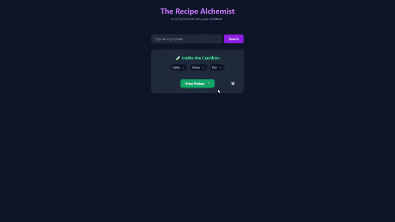
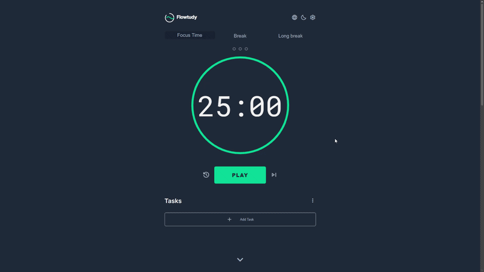

   

  
  
  

    

  <h3>Flávio Tomás Peña Villa</h3>

   

  

    

  <samp>
    react • typescript • tailwind • python • node.js
  </samp>

  

  <samp><b>Stack & Skills</b></samp>
    

  
  
  
  
  
   

  
  
  
  

   

  
  
  
  

  

  <h3>Sobre mim</h3>
   

  <samp>
    ✦ Cursando <b>Engenharia de Software</b> com ênfase em IA (Infnet)  
    ✦ <b>MBA</b> em Inteligência Artificial e Automações para Negócios  
    ✦ Desenvolvimento Front-end com foco em <b>performance</b> e <b>escalabilidade</b>  
    ✦ Experiência com gerenciamento de estado e consumo de APIs complexas  
    ✦ Inglês Avançado e Espanhol Intermediário  
  </samp>

  

  <h3>Projetos em Destaque</h3>
   
  
  <table>
    <tr>
      <td width="50%" align="center">
        <b>Recipe Alchemist</b>  
          
        <a href="https://recipe-alchemist-seven.vercel.app">Live Demo</a> | <a href="https://github.com/FlavioTomas/recipe-alchemist">Repositório</a>
      </td>
      <td width="50%" align="center">
        <b>Flowtudy Pomodoro</b>  
          
        <a href="https://flowtudy.com">Live Demo</a> | <a href="https://github.com/FlavioTomas/Flowtudy-Pomodoro">Repositório</a>
      </td>
    </tr>
  </table>

  

  <h3>Estatísticas</h3>
   
  
  

  

  
  

